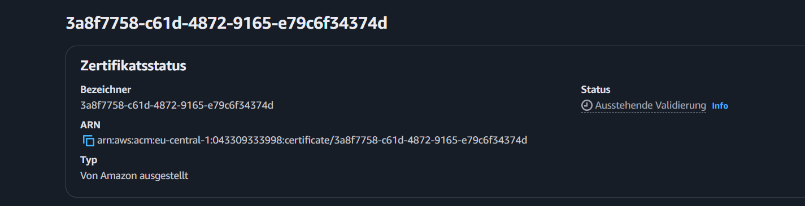
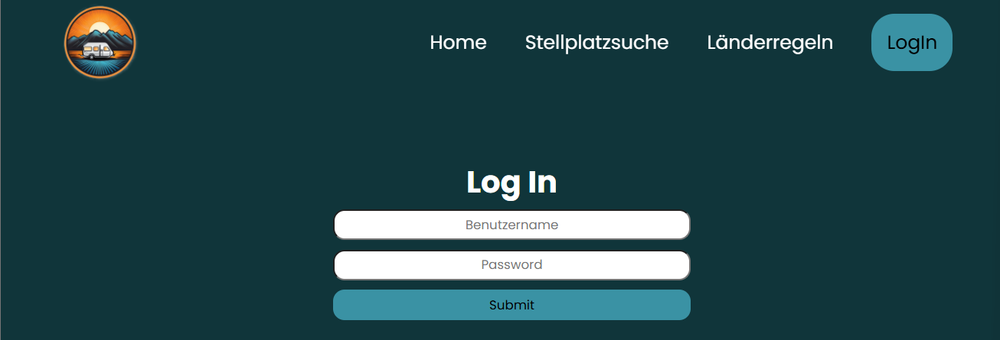
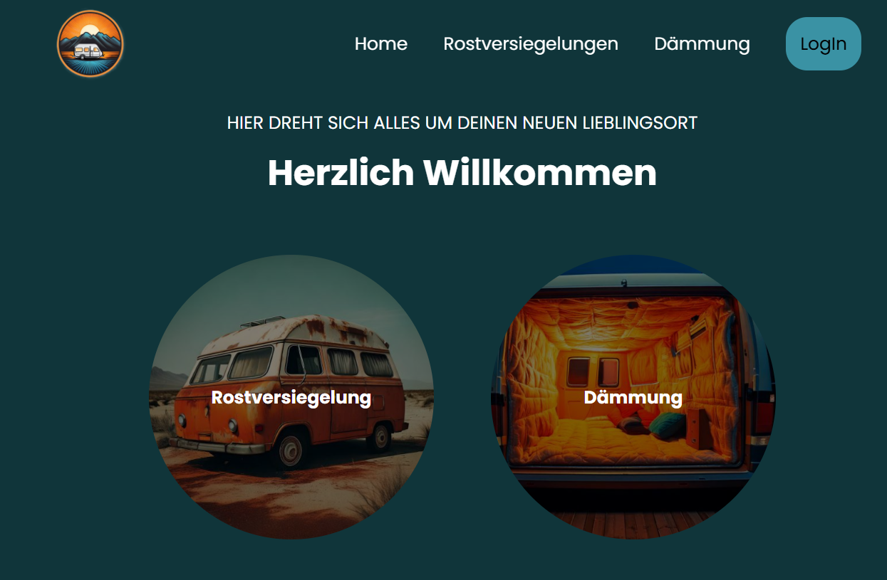

> 14.02.2025

# Tag 10:

### Alleine:

- SSL Zertifikat dem Load Balancer hinzugefügt.
- Listener auf HTTPS umgestellt.
- In Route53 einen neuen CNAME Datensatz hinzugefügt.
- Terraform angepasst.

### Alle zusammen:

---

> 13.02.2025

# Tag 9:

### Alleine:

- Appbrewery Course für Authentication gestartet
- Mit Dimitar durch die Fehlermeldungen bei Cognito durch gegangen.
- Domain gekauft.
- SSL Zertifikat für die Domain van-ventura.eu über den Certificate Manager in Auftrag gegeben.
  - Warte noch auf Validierung
    
- Register Form geschrieben
- Recherche Domain mit ELB verbinden
- Domain mit Elastic Load Balancer über den Datensatz verbunden.

---

> 12.02.2025

# Tag 8:

### Alleine:

- Frontend aufbau der Blogs erstmal provisorisch fertig gestellt.
- Fehlersuche ansible script.
- Ansible Funktionsfähig eingebunden
- Cognito Plan über den Haufen geworfen - wird die nächsten Tage händisch geschrieben.
  - will zwingend SSL Zertifikat
- Private Routen in React gesetzt.
- Videos zur Authentication geschaut um mir einen Überblick zu geben.
- Aufgaben für meine Teammitglieder gesucht.

---

> 11.02.2025

# Tag 7:

### Alleine:

- mit Sophie überlegt, wie ich die Integration mit Cognito am besten umsetzten kann, dann auf weitere Probleme gestoßen
  - Cognito braucht eine URL an die es nach dem LogIn verweißt, diese ändert sich momentan aber dauerhaft, da wir momentan noch mit Userdata arbeiten und um ein neues Image auf die Instanzen laden zu können, müssen diese gelöscht und neu hergestellt werden
    - LÖSUNG: Python Script um die IP-Adressen dynamisch abfragen zu können.
  - Um die Routen nicht öffentlich zugänglich zu machen, sollten diese als Private Routen in React-Router-DOM eingefüt werden.
- Zu beiden Problemen habe ich Links bekommen und arbeite mich durch.
  - Ansible Scripts geschrieben und ausprobiert
    - mittlerweile bin ich soweit, das er lokal die IP-Adressen erkennt nur im Workflow noch nicht.
    - Playbook ist auch soweit geschrieben
    - Workflow ist abgeändert

---

> 10.02.2025

# Tag 6:

### Alleine:

- Weitere ToDos für das Projekt in Notion gesammelt
- Mit der Implementierung von Cognito vertraut gemacht
- React Router DOM Implementiert und React Scroll durch React Router DOM ersetzt.
- Eigene Impressum Seite verlinkt.
- Problem bei der CI/CD Pipeline entdeckt.
  - Wenn die Container über die Userdata laufen, dann wir immer nur beim erstellen der EC2 Container das passende Image überspielt. Das heißt man müsste mit jeder Änderung dafür sorgen, das ein Terraform destroy und anschließend wieder ein Apply ausgeführt wird. - Ich bin noch dabei eine andere Lösung zu finden.
- Provisorische LogIn Seite erstellt
  
- Angefangen die Seite nach dem Login zu schreiben.
  

### Alle zusammen:

- Fehlersuche

---

> 07.02.2025

# Tag 5:

### Alleine:

- envs in Secrets gespeichert und geschaut, dass die Map auf den Instanzen angezeigt werden.
  
- die Auslösung der Workflows überarbeitet.
- AWS Cognito Videos geschaut

### Alle zusammen:

- uns mit Vitest auseinander gesetzt.
- Tests geschrieben und ausprobiert.

---

> 06.02.2025

# Tag 4:

### Alleine:

- Recherche `depends_on` für terraform.
- Terraform apply auslösung auf push wieder eingefügt.
- `depends_on` in Terraform ergänzt.
- Terraform apply und Terraform destroy laufen nun fehlerfrei durch
- Probiert herauszufinden warum meine Instanzen als "unhealthy" gekennzeichnet sind.
  - Händisch die Schritte der Userdata nachgegangen, dabei herausgefunden, dass es docker nicht mehr so leicht auf dem apt Paketmanager verfügbar ist also musste ich die `Userdata.tpl` umändern.
  - Routing Tabelle von Subnet 3 nachgetragen.
- VanVentura Seite ohne Map zum auf den EC2 Instanzen zum laufen gebracht. Beide Instanzen sind Healthy und der DNS Link des LoadBalancer läuft auch.
  
- Amazon Cognito Recherche.
- README.md Technologien ergänzt

---

> 05.02.2025

# Tag 3:

### Alleine:

- AWS Benutzer "Bob" erstellt, um dauerhafte Zugriffsschlüssel zu bekommen.
- Ansible aus dem Workflow auskommentiert
- dem Launch Template UserData hinzugefügt um direkt auf den Instanzen einen Docker Container laufen zu lassen.
- Den Fehler der Credentials von AWS in den Workflows gelöst.
- "Bob" die passenden Berechtigungen erteilt.
- Instanzen die durch die Auto-Scaling-Group erstellt werden Öffentliche IP-Adressen frei gegeben.
- Terraform apply verändert, das es nur noch auf den Push ausgelöst wird.
- Versucht die Infrastruktur wieder zu destroyen, Leider mit Fehlermeldungen.
  
- Terraform Apply auf Push auskommentiert, das ich mich erstmal um die Fehlermeldungen bei Terraform destroy kümmern kann.

### Alle zusammen:

- wenn es kleinere Fehler oder Probleme gab uns gegenseitig unterstützt.

---

> 04.02.2025

# Tag 2:

### Alleine:

- Terraform Fehler korrigiert
  - noch vorhanderer Fehler IP-Adressen werden nicht in die inventory.ini File geschrieben (Es gibt keinen richitigen Output der IP-Adressen). Ohne diesen Fehler läuft die Pipeline aber mittlerweile Fehlerfrei durch.
- Ansible Code verbessert und auf Fehlersuche
- Workflows angepasst
- Viele verschiedenst Varianten der Fehlerbehbung ausprobiert.

### Alle zusammen:

- Aufgaben verteilt
- Erste Gedanken über das Vorher innerhalb der Präsentation ( Ausgangslage )

---

> 03.02.2025

# Tag 1:

### Alleine:

- vorhandene VanVentura Dateien in dieses Repo kopiert.
- Mit Github Actions angefangen.
  - Recherche für die `Dockerfile` unter Vite.
  - `Dockerfile` und `.dockerignore` erstellt.
  - Workflows an den jetzigen Stand angepasst, was noch nicht benutzt wird auskommentiert.
  - Recherche tests ausführen unter Vite.
  - Für Vitest alles vorbereitet.
  - Terraform Dateien erstellt.
  - Ansible Dateien hinzugefügt.
  - Übergangslösungen gefunden, um die Pipeline testen zu können, trotz fehlendem Backend.
    - Die `Sleepspots.json` innerhalb eines `data` Ordners im `frontend/src` Ordner
  - Secrets dem Repo hinzugefügt

### Alle zusammen:

- Planung fortgesetzt
  
- Aufgaben verteilt
  

---

#### Vorlage:

> DATUM

# Tag ?:

### Alleine:

### Alle zusammen:

---
