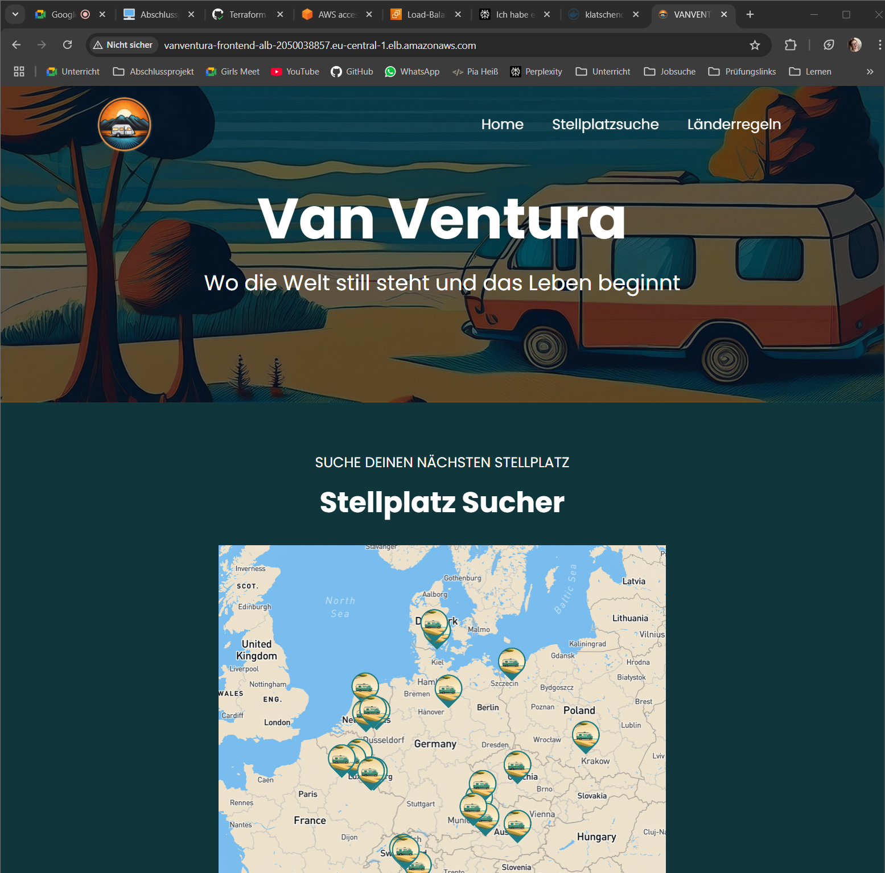
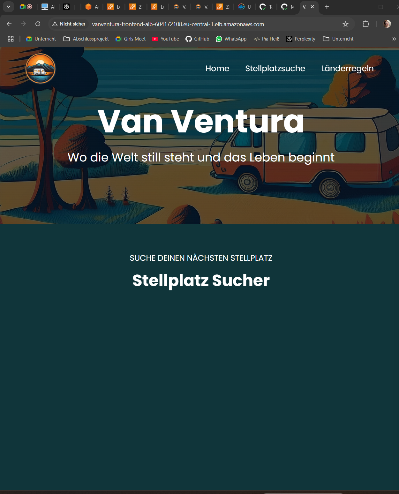
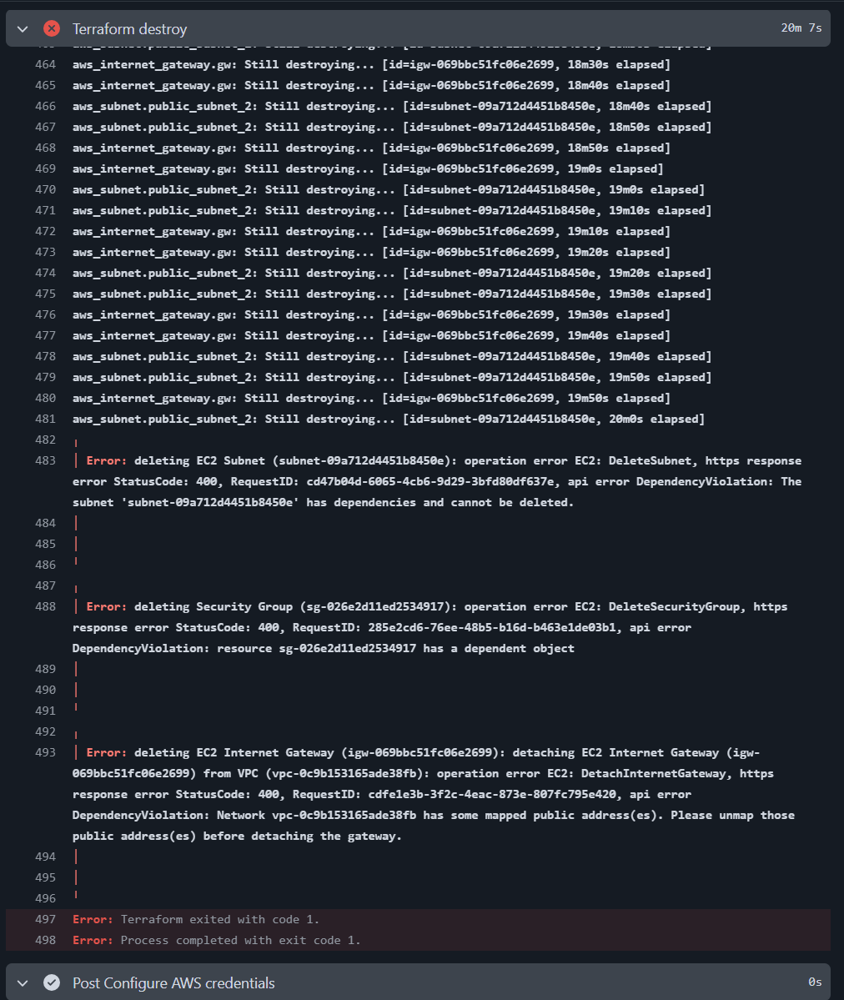
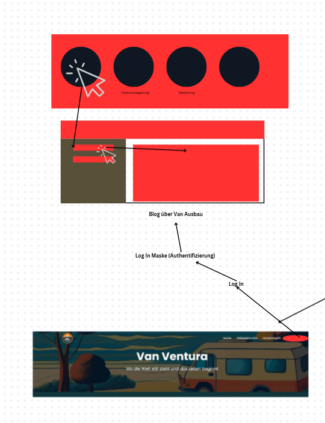
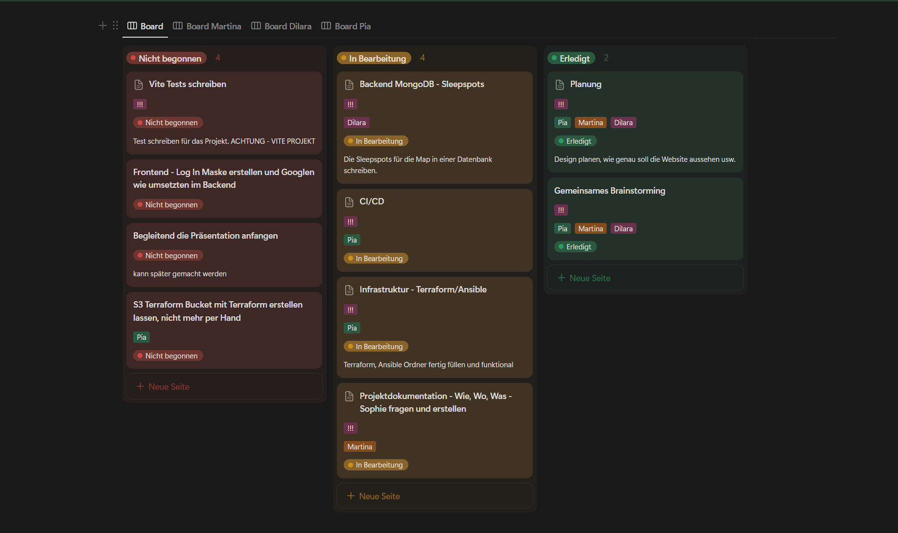

> 07.02.2025

# Tag 5:

### Alleine:

- envs in Secrets gespeichert und geschaut, dass die Map auf den Instanzen angezeigt werden.
  
- die Auslösung der Workflows überarbeitet.
- AWS Cognito Videos geschaut

### Alle zusammen:

> 06.02.2025

# Tag 4:

### Alleine:

- Recherche `depends_on` für terraform.
- Terraform apply auslösung auf push wieder eingefügt.
- `depends_on` in Terraform ergänzt.
- Terraform apply und Terraform destroy laufen nun fehlerfrei durch
- Probiert herauszufinden warum meine Instanzen als "unhealthy" gekennzeichnet sind.
  - Händisch die Schritte der Userdata nachgegangen, dabei herausgefunden, dass es docker nicht mehr so leicht auf dem apt Paketmanager verfügbar ist also musste ich die `Userdata.tpl` umändern.
  - Routing Tabelle von Subnet 3 nachgetragen.
- VanVentura Seite ohne Map zum auf den EC2 Instanzen zum laufen gebracht. Beide Instanzen sind Healthy und der DNS Link des LoadBalancer läuft auch.
  
- Amazon Cognito Recherche.
- README.md Technologien ergänzt

### Alle zusammen:

---

> 05.02.2025

# Tag 3:

### Alleine:

- AWS Benutzer "Bob" erstellt, um dauerhafte Zugriffsschlüssel zu bekommen.
- Ansible aus dem Workflow auskommentiert
- dem Launch Template UserData hinzugefügt um direkt auf den Instanzen einen Docker Container laufen zu lassen.
- Den Fehler der Credentials von AWS in den Workflows gelöst.
- "Bob" die passenden Berechtigungen erteilt.
- Instanzen die durch die Auto-Scaling-Group erstellt werden Öffentliche IP-Adressen frei gegeben.
- Terraform apply verändert, das es nur noch auf den Push ausgelöst wird.
- Versucht die Infrastruktur wieder zu destroyen, Leider mit Fehlermeldungen.
  
- Terraform Apply auf Push auskommentiert, das ich mich erstmal um die Fehlermeldungen bei Terraform destroy kümmern kann.

### Alle zusammen:

- wenn es kleinere Fehler oder Probleme gab uns gegenseitig unterstützt.

---

> 04.02.2025

# Tag 2:

### Alleine:

- Terraform Fehler korrigiert
  - noch vorhanderer Fehler IP-Adressen werden nicht in die inventory.ini File geschrieben (Es gibt keinen richitigen Output der IP-Adressen). Ohne diesen Fehler läuft die Pipeline aber mittlerweile Fehlerfrei durch.
- Ansible Code verbessert und auf Fehlersuche
- Workflows angepasst
- Viele verschiedenst Varianten der Fehlerbehbung ausprobiert.

### Alle zusammen:

- Aufgaben verteilt
- Erste Gedanken über das Vorher innerhalb der Präsentation ( Ausgangslage )

---

> 03.02.2025

# Tag 1:

### Alleine:

- vorhandene VanVentura Dateien in dieses Repo kopiert.
- Mit Github Actions angefangen.
  - Recherche für die `Dockerfile` unter Vite.
  - `Dockerfile` und `.dockerignore` erstellt.
  - Workflows an den jetzigen Stand angepasst, was noch nicht benutzt wird auskommentiert.
  - Recherche tests ausführen unter Vite.
  - Für Vitest alles vorbereitet.
  - Terraform Dateien erstellt.
  - Ansible Dateien hinzugefügt.
  - Übergangslösungen gefunden, um die Pipeline testen zu können, trotz fehlendem Backend.
    - Die `Sleepspots.json` innerhalb eines `data` Ordners im `frontend/src` Ordner
  - Secrets dem Repo hinzugefügt

### Alle zusammen:

- Planung fortgesetzt
  
- Aufgaben verteilt
  

---

#### Vorlage:

> DATUM

# Tag ?:

### Alleine:

### Alle zusammen:

---
