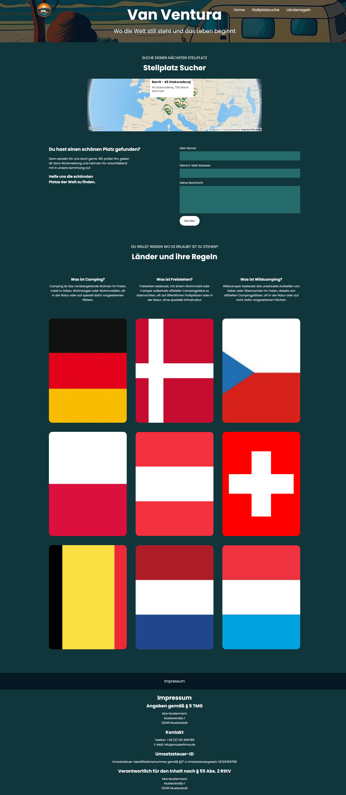
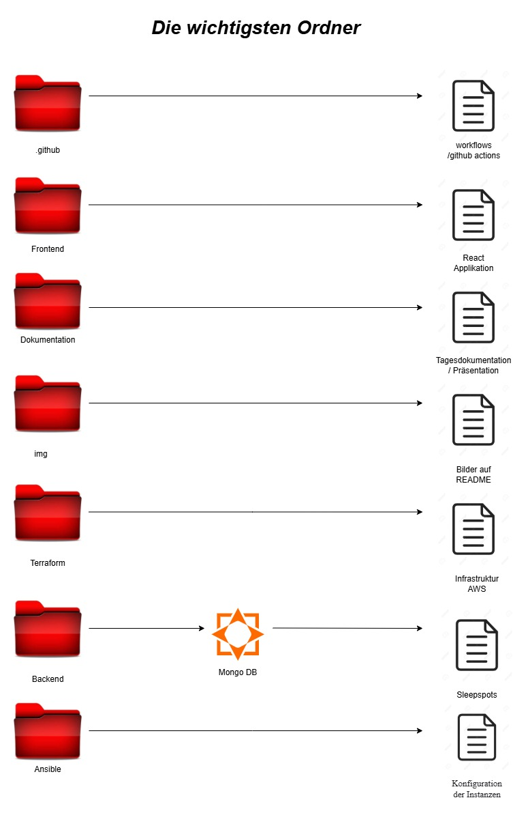

# Projektname: VanVentura - Camperapp mit Routenplaner



### Inhaltsverzeichnis

1. [Projektbeschreibung](#projektbeschreibung)
2. [Technologien](#technologien)
3. [Installation](#installation)
4. [Projektstruktur](#projektstruktur)
5. [Testen](#testen)

### Projektbeschreibung

Van Ventura ist ein innovatives Projekt, das sich an leidenschaftliche Camper und solche
richtet, die es noch werden möchten. Die Website bietet eine umfassende Übersicht über die
Campingregeln verschiedener Länder (die Flaggen mit Hover Effekt) und integriert einen Stellplatzfinder. Das Design der Plattform
ist sowohl verspielt als auch minimalistisch gehalten, was eine benutzerfreundliche und
ansprechende Erfahrung gewährleistet.

## Technologien

- Frontend: React, Vite, Mapbox,
- AWS Dienste: Cognito, Route53, AWS Certificate Manager, Auto Scalling Group, Load-Balancer, 
- Backend: Node.js + Express
- Datenbank: MongoDB Atlas
- Infrastruktur: Terraform, Ansible + CI/CD durch github Action
- Testing: Vitest
- Dokumentation: Postman, draw.io

## Installation

1. Klone das Repository
   ```bash
   git clone git@github.com:klatschenderaffe/VAN_VENTURA.git
   ```
2. Wechsel in das Frontend Verzeichnis
   ```bash
   cd VAN_VENTURA/Frontend
   ```
3. Installiere alle Abhängigkeiten
   ```bash
   npm install
   ```
4. Starte den Server
   ```bash
   npm run dev
   ```
5. Rufe den Server auf
   [http://localhost:5173/](http://localhost:5173/)

## Projektstruktur



### Testen

- auf vitest ändern
